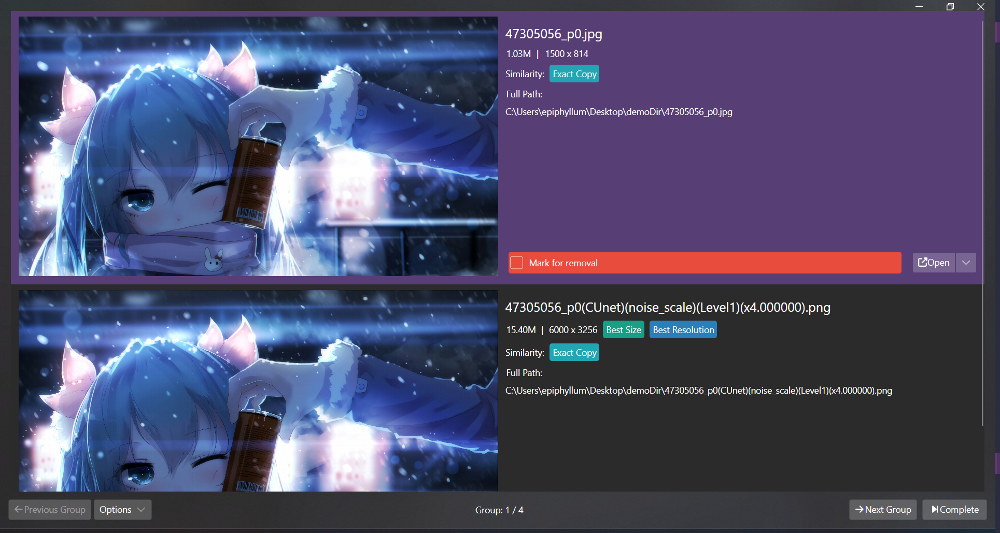

# PixNinja.GUI

A handy utility for scanning and analyzing all duplicate images on your system using Image Hash.

**Warning: This project is still a work in progress (WIP), and most of the features may not work properly.**



## Develop

This project is built with .NET 7.

You need to install [.NET 7 SDK](https://dot.net) first, then run the following command to build the project.

```shell
# Restore and Build
cd PixNinja.GUI && dotnet build

# Run
dotnet run
```

We are strongly suggest using the following Code Editor to develop:

- Rider
- Visual Studio
- Visual Studio Code

## Copyright

Copyright 2023 EdgeNeko

Licensed under GPLv3 license.
